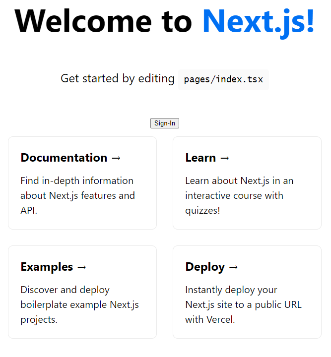
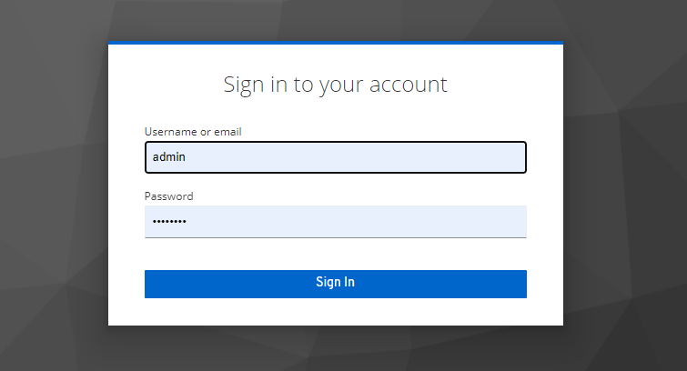
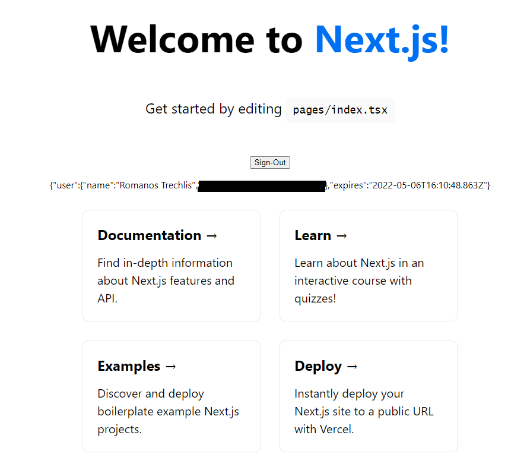

# next-auth-keycloak
This repo is an example authentication with next-auth and keycloak provider.

[next-auth keycloak](https://next-auth.js.org/providers/keycloak)

## Keycloak configuration

Run `docker-compose -f keycloak-docker-compose.yml up -d` in order to start the keycloak server with a `postgresql` database for persistence.

Create a new *realm*, add users, and **create an openid-connect client with "confidential" as the "Access Type"**.

## Configure next-auth

The first step is to configure the next-auth provider to Keycloak. Under the `/api/auth` directory create a new file `[...nextauth].ts`.

The important bit is the provider definition:

```
KeycloakProvider({
            clientId: "<CLIENT_ID>",
            clientSecret: "<CLIENT_SECRET>",
            issuer: "http://localhost:8080/auth/realms/<REALM>",
        }),
```

The issuer parameter must contain the **realm**.

There is a problem with invalidating the session on the keycloak server when we Sign-Out. This is resolved with the following bit.

```
const {push} = useRouter();

const logout = () => {
  signOut({redirect: false}).then(() =>
      push(
          `http://localhost:8080/auth/realms/<REALM>/protocol/openid-connect/logout?redirect_uri=${encodeURIComponent(
              "http://localhost:3000/"
          )}`
      )
  );
}
```

On the Sign-Out operation we set the redirect to *false* and on *then* we use the router hook to push to keycloak logout api with 
specific redirect uri.



After clicking on the Sign-In button we are redirected to keycloak's login screen.


After successfully logging in, we are redirected back to Home.



Interesting read on the Sign-Out function is this [reddit comment](https://www.reddit.com/user/doombubbles/).


## Getting Started

This is a [Next.js](https://nextjs.org/) project bootstrapped with [`create-next-app`](https://github.com/vercel/next.js/tree/canary/packages/create-next-app).

First, run the development server:

```bash
npm run dev
# or
yarn dev
```

Open [http://localhost:3000](http://localhost:3000) with your browser to see the result.

You can start editing the page by modifying `pages/index.tsx`. The page auto-updates as you edit the file.

[API routes](https://nextjs.org/docs/api-routes/introduction) can be accessed on [http://localhost:3000/api/hello](http://localhost:3000/api/hello). This endpoint can be edited in `pages/api/hello.ts`.

The `pages/api` directory is mapped to `/api/*`. Files in this directory are treated as [API routes](https://nextjs.org/docs/api-routes/introduction) instead of React pages.

## Learn More

To learn more about Next.js, take a look at the following resources:

- [Next.js Documentation](https://nextjs.org/docs) - learn about Next.js features and API.
- [Learn Next.js](https://nextjs.org/learn) - an interactive Next.js tutorial.

You can check out [the Next.js GitHub repository](https://github.com/vercel/next.js/) - your feedback and contributions are welcome!

## Deploy on Vercel

The easiest way to deploy your Next.js app is to use the [Vercel Platform](https://vercel.com/new?utm_medium=default-template&filter=next.js&utm_source=create-next-app&utm_campaign=create-next-app-readme) from the creators of Next.js.

Check out our [Next.js deployment documentation](https://nextjs.org/docs/deployment) for more details.
